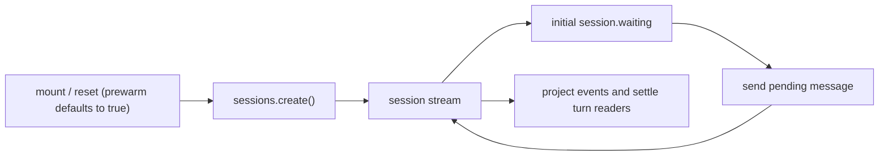

# Session prewarming

## Summary

The eve HTTP channel can create a conversation session before its first message. This lets a
browser start Workflow, claim the session inbox, and run session-scoped lifecycle handlers while
the user is still composing their first turn.

## Authoring API

The HTTP API accepts `POST /eve/v1/session` with an empty object. The TypeScript client exposes the
same operation as `client.sessions.create()`. React, Vue, and Svelte accept
`useEveAgent()` to initialize on mount and after reset by default (`prewarm: false` opts out); `prewarm()` is also available
for explicit control. Existing `client.sessions.create({ message })` calls still create the session and start
turn zero in one request.

Message-free creation is conversation-only. It accepts request auth and session capabilities, but
rejects turn-scoped context, output schemas, callbacks, and activity observers. The lower-level create promise
keeps the existing acceptance boundary: it resolves after the server returns `202`, before the
workflow necessarily reaches its parked state.

## Runtime boundary

A prewarmed workflow creates durable session state and claims its stable inbox, emits
`session.started`, runs session-scoped lifecycle handlers, emits `session.waiting`, and blocks on
the inbox. It does not run channel delivery, emit `turn.started`, or invoke a model. The first
message resumes that inbox and remains `turn_0`.

Session tracing starts during prewarming, while turn tracing starts only after the first delivery.
Session initialization state, including dynamic instructions and sandbox state requested by
session handlers, is committed before the workflow parks.

## Frontend lifecycle

The store owns one continuously consumed session stream. Short-lived readers observe readiness
and message completion without closing the transport. The frontend `prewarm()` promise resolves
at the initial `session.waiting`, and a concurrent send waits for that boundary. A failed create
can fall back to create-with-message; an accepted session that fails initialization requires reset.

Resume uses the first connection's durable tail index to finish catch-up while the same stream
continues following live events. Transport disconnects and server lease expiry reconnect from the
cursor. Reset and unmount release readers and abort the local transport without cancelling durable
execution. React schedules mount work after commit and cancels the scheduled work during Strict
Mode cleanup. Externally owned sessions are never replaced automatically.

## Boundaries

This change does not add address-based creation to custom channels or a separate prewarm timeout.
The configured session timeout begins at creation. Low-level SDK sends retain their existing
startup retries and finite per-turn response iterators. Frontend bindings share a persistent stream
and use its events for readiness, projection, and turn completion.
