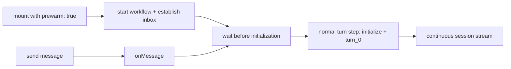

# Session prewarming

## Authoring API

`POST /eve/v1/session` with `{}` and `client.sessions.create()` start a conversation workflow
without a message. They return an accepted session ID. `session.send(message)` sends the first
message to that ID; `create({ message })` still creates and starts a turn in one request.

React, Vue, and Svelte accept `useEveAgent({ prewarm: true })` to prewarm on mount and after
reset. The default is `false`. The explicit `prewarm()` method resolves on `202 Accepted`;
concurrent calls share the same request. Applications must have auth, headers, and any chat-row
binding ready before opting into automatic prewarming.

## Runtime boundary

Prewarming starts Workflow, creates the initial durable snapshot, and claims the existing inbox.
It parks before channel delivery, session hooks, dynamic definitions, sandbox setup, and tracing
of the first turn. No initial `session.started` or `session.waiting` event is emitted.

The first message runs `onMessage`, then resumes the inbox. The normal turn step initializes the
session with that message's auth and context and starts `turn_0`. The initiator is established
from that first message unless explicitly forwarded at creation. The workflow title is set from
`onMessage.title` or the first message; later messages do not rename it. No separate initialization
step or harness mode is needed.

## Acceptance and retries

UI `ready` means the composer accepts input, not that the inbox is already registered. A send
waits for an in-flight create response, then posts immediately without a stream-event barrier.
An unclaimed inbox on a pending or running workflow returns `409 session_not_ready`. The client
retries sends three times with 250 ms, 500 ms, and 1 second delays, respecting cancellation.
Unknown and terminal sessions return `session_not_active` without retries or replacement.

The store consumes one session stream across turns. Resume uses its initial durable tail index
to finish catch-up. Disconnects and renewable leases reconnect from the cursor; reset and unmount
close the local transport without cancelling durable execution. External sessions are never
replaced automatically. Strict Mode effect replay does not create duplicate sessions.

## Boundaries

Message-free creation is conversation-only and rejects turn-scoped client context, output schemas,
callbacks, and activity observers. Audience and the session timeout are selected at creation.
The timeout also bounds unused prewarmed sessions. No activation/reservation API or special proxy
binding protocol is introduced. Controls that require history do not initialize an empty session.
